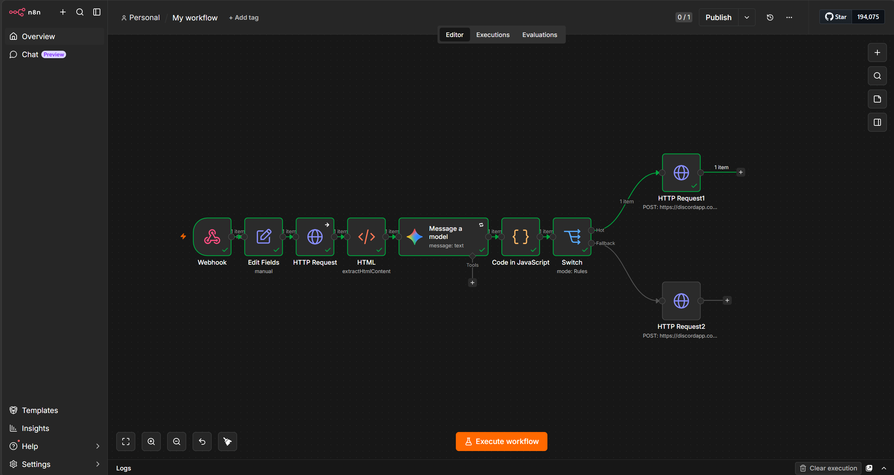
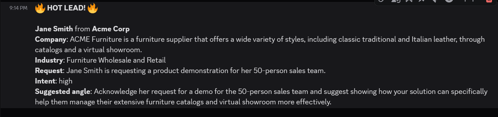

# Inbound-Lead-Pipeline-self-hosted-n8n
A business-grade automation that receives an inbound sales lead, enriches it with real, grounded company data, scores its buying intent with an LLM, routes it by priority, and posts a formatted brief to a Discord channel — built on self-hosted n8n (Docker), with Google Gemini for enrichment.
> **In one sentence:** a raw web-form lead comes in one end; a sales-ready brief —
> "who they are, what they want, how hot they are, how to open the reply" — comes out
> the other, in the team's chat, seconds later.

## The problem

Inbound leads arrive thin: a name, an email, a one-line message. Before anyone can
respond well, someone has to figure out who the company is, what they do, whether the
lead is worth prioritising, and how to pitch them. Done by hand, that research is slow
and inconsistent, and hot leads wait in the same undifferentiated queue as tyre-kickers.

This pipeline does that triage automatically: it enriches each lead with real company
information, scores its buying intent, and routes urgent leads to the front — so a
sales rep opens their chat to a ready-to-action brief instead of a bare email address.

---

## What I built

A four-stage pipeline, the standard shape of real business automation:

1. **Intake** — a webhook receives the lead (name, email, company, message).
2. **Enrich** — the pipeline derives the company domain, fetches the company's
   actual website, cleans it to readable text, and feeds that to an LLM which returns
   a structured brief: what the company does, likely industry, what the lead wants,
   buying intent, and a suggested reply angle.
3. **Route** — a Switch node branches the lead by buying intent: high intent is
   treated as urgent; everything else takes the calmer path.
4. **Notify** — each branch posts a formatted message to a Discord channel, with
   hot leads styled to stand out.

**Stack:** self-hosted n8n (Docker on Windows/WSL2) · Google Gemini (Flash,
free tier) · Discord webhooks · JavaScript (a Code node for JSON parsing).

---

## How it works

### 1. Intake — a decoupled webhook

The entry point is an n8n **Webhook** node that accepts a POST request carrying the
lead as JSON. As in any clean integration, the webhook decouples how a lead arrives
(a web form, a test request, an external service) from what happens to it — the rest
of the pipeline doesn't care about the source.

### 2. Enrich — and the grounding problem I had to solve

This is the heart of the project, and it's where the interesting engineering happened.

**First attempt — naive LLM enrichment.** I passed the lead (including the company
name) straight to Gemini and asked it to infer the industry and what the company does.
It returned a confident but wrong answer. For a test lead at `acmecorp.com`, it guessed
"Manufacturing or B2B Software." The real company is a furniture wholesaler (I mean the
company that the acmecorp.com domain returns).

This was probably due to the model not having actual knowledge of this specific company;
it pattern-matched the generic Acme Corp name to a plausible-sounding guess — in brief,
it hallucinated.

**The fix — grounding.** Instead of asking the model to recall facts it doesn't have,
I gave it real source material to summarise:

- **Derive the domain** from the email (jane@acmecorp.com -> acmecorp.com) with a small expression.
- **Fetch the company's real website** with an HTTP Request node. The first fetch was blocked (HTTP 403) by the site's bot-protection firewall, which rejected the request because it identified itself as `n8n`. I added a browser-like User-Agent header, which got past basic bot detection.
- **Clean the HTML to text** with an HTML-extraction node, stripping `<script>` and `<style>` so only readable content reaches the model.
- **Summarise the grounded text** with Gemini, with a prompt that explicitly instructs it to use only the website text for company facts and to say so if it can't find the information — rather than guessing.

After grounding, the same lead was correctly identified as a furniture wholesaler, with
specifics drawn from the real site (dealer network, virtual showroom, financing). The
hallucination was gone because the model was now summarising facts rather than
recalling them.

> I evaluated Gemini's built-in Google-Search grounding as an alternative, but it
> required a paid API tier, so I built the grounding myself via direct website fetch —
> which also gives more control over the source (the company's own site) using the
> HTTP Request node.

### 3. Structured output — making the LLM machine-readable

For routing to work, the model's answer can't be prose — the pipeline needs to read the
buying intent as a clean value. So Gemini is prompted to return structured JSON with
fixed fields (`company_summary`, `industry`, `lead_request`, `buying_intent`,
`suggested_angle`), and `buying_intent` constrained to exactly high / medium / low.

### 4. Route — branching by priority

A **Switch** node reads `buying_intent` and splits the flow: high goes down the "hot"
path, and a fallback output catches everything else.

### 5. Notify — formatted Discord briefs

*(Could've used Slack, but I already had a Discord server I use with my friends — saving
5 whole whopping minutes was too important.)*

Each branch posts to a Discord webhook. Hot leads get an attention-grabbing, bold
message; other leads get a calmer one — so a glance at the channel separates urgent from
routine. The message is assembled from the enriched fields using n8n expressions, with
data pulled from earlier nodes via `$('NodeName')` references.

---

## Resilience touches

- **API retry handling:** the free-tier Gemini endpoint occasionally returns a
  rate-limit error under rapid testing, so the LLM node is configured to retry
  automatically with a delay — the standard pattern for transient API failures.
- **Fetch failure tolerance:** sites that block automated requests are handled so a
  single unreachable site doesn't crash the whole run.

---

## Design decisions

- **Grounding over recall.** Fed the model real fetched website text rather than
  letting it infer company facts from the name — eliminating hallucinated enrichment.
- **Structured JSON output.** Constrained the model to a fixed `buying_intent` value so
  routing is deterministic rather than parsing prose.
- **Fallback routing.** Caught all non-hot leads with a fallback output instead of
  enumerating every value — no lead silently unmatched.
- **Self-hosted via Docker.** Free, unlimited, and reflects working comfort with
  containers and local infra. ;)
- **Built the grounding by hand** (HTTP fetch) rather than relying on a paid search
  feature — more control over the source (and yes, also because I'm not paying for a
  search API to look up one website).

---

## Self-hosting notes

n8n runs locally in Docker (with a persistent volume so workflows survive restarts).
During development the webhook uses n8n's Test URL, reachable from the same machine. To
accept leads from a public web form, the next step is either a tunneling tool to expose
the local instance or redeploying the same container to a small always-on VPS — usual
dev->production promotion.

---

## What I'd improve next

- **A real public form** feeding the webhook (currently tested via direct POST), exposed
  via a tunnel or a VPS deployment.
- **Persist every lead** to a database (Airtable / Postgres) alongside the Discord
  notification, for a searchable history and reporting.
- **Harden JSON parsing** against occasional malformed model output (validation /
  error branch) — currently assumes well-formed JSON.
- **Richer routing:** distinct handling for medium vs. low, and routing different
  industries to different owners.

---

## Key techniques

- Building a complete, multi-stage business automation (intake -> enrich -> route ->
  notify) on self-hosted infrastructure.
- Diagnosing and solving real-world constraints: LLM hallucination, bot-protection
  firewalls, HTML cleanup, layered escaping, and API rate limits.
- Using an LLM for both *generation* (a suggested reply angle) and *extraction*
  (structured, machine-readable enrichment) — and knowing the difference.
- Grounding an LLM in real source data to make its output trustworthy — the central
  skill in applied AI automation.
